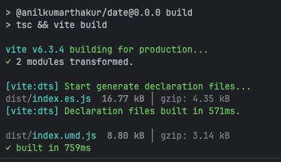

<p align="center">
  
</p>

<h1 align="center">snaptime</h1>

<p align="center">
  <strong>Monorepo for <a href="https://www.npmjs.com/package/@anil-labs/snaptime"><code>@anil-labs/snaptime</code></a>  a modern, zero-dependency TypeScript date/time library.</strong><br />
  Formatting · Parsing · Timezones · Business Days · Cron · RRULE · Natural Language · Bikram Sambat · Astronomy  all in one.
</p>

<p align="center">
  <a href="https://www.npmjs.com/package/@anil-labs/snaptime"></a>
  <a href="./LICENSE"></a>
  
</p>

<p align="center">
  <a href="https://anilkumarthakur60.github.io/snaptime/">📖 Documentation</a> ·
  <a href="https://www.npmjs.com/package/@anil-labs/snaptime">📦 npm</a> ·
  <a href="https://github.com/anilkumarthakur60/snaptime">🐙 GitHub</a>
</p>

---

## Packages

| Package | Description |
|:--------|:------------|
| [`@anil-labs/snaptime`](./packages/snaptime) | The library  ESM + CJS + CDN global builds, full type declarations |

## Repo layout

```
packages/snaptime/   the published library (src, tests, tsup build)
examples/playground  Vite + TypeScript playground (pnpm dev)
examples/cdn         plain <script>-tag demo against the IIFE bundle
docs/                VitePress documentation site
```

## Quick start (consumers)

```bash
pnpm add @anil-labs/snaptime
```

```typescript
import d8 from '@anil-labs/snaptime'

d8('2026-03-18').add(7, 'day').format('dddd, MMMM Do YYYY')
```

Or straight off a CDN:

```html
<script src="https://unpkg.com/@anil-labs/snaptime"></script>
<script>
  Snaptime.dateTime('2026-03-18').format('YYYY-MM-DD')
</script>
```

See the [package README](./packages/snaptime/README.md) for the full feature tour and API
overview, and the [documentation site](https://anilkumarthakur60.github.io/snaptime/) for
guides and the complete API reference.

## Development

```bash
pnpm install
pnpm build          # build the library (ESM + CJS + IIFE + d.ts)
pnpm test           # run the test suite (Vitest)
pnpm test:coverage  # with coverage
pnpm typecheck      # strict TypeScript across the workspace
pnpm lint           # ESLint (type-aware on library source)
pnpm format         # Prettier
pnpm dev            # playground example (Vite)
pnpm docs:dev       # documentation site (VitePress)
```

Releases are managed with [Changesets](https://github.com/changesets/changesets): merging
to `main` opens a "Version Packages" PR; merging that PR publishes to npm.

## License

[MIT](./LICENSE) © [Anil Kumar Thakur](https://github.com/anilkumarthakur60)
